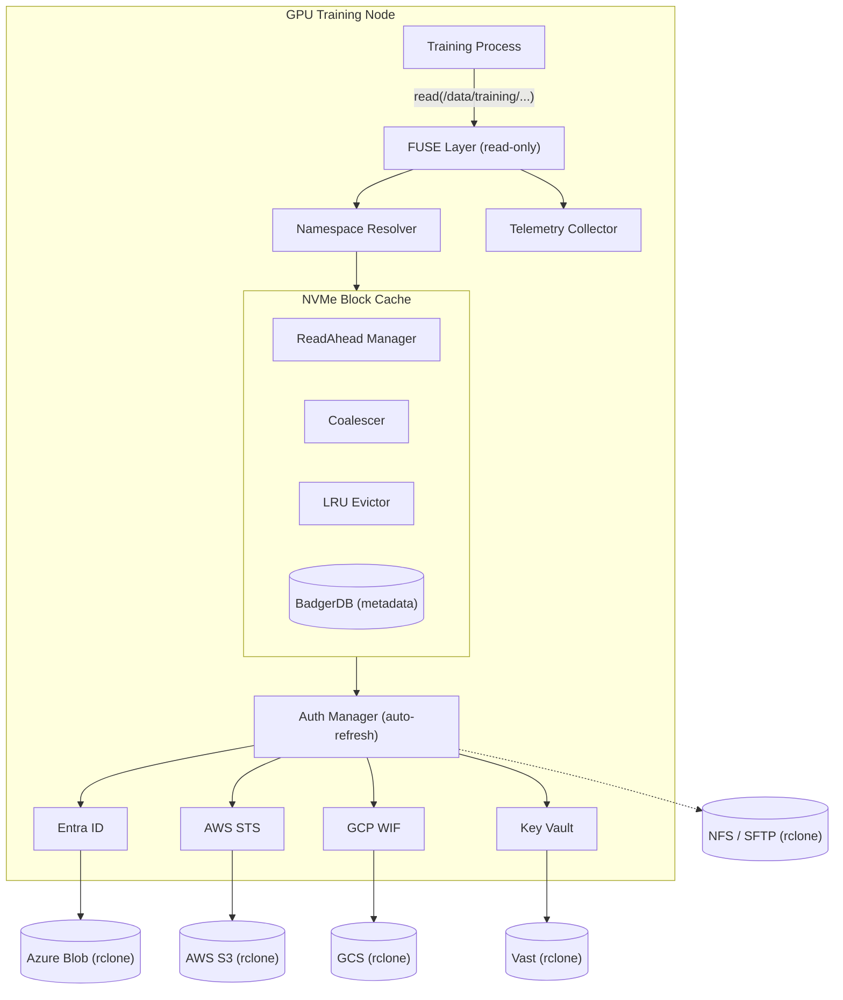
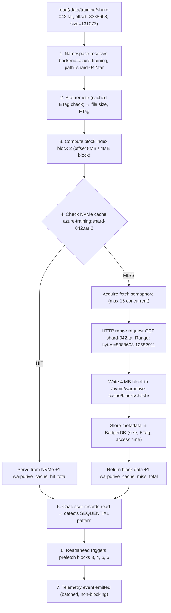
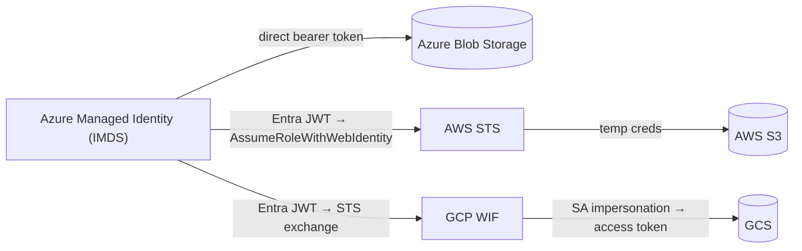

# WarpDrive

**Cross-cloud data fabric for GPU training workloads.**

WarpDrive presents a unified POSIX filesystem (via FUSE) over heterogeneous cloud
storage backends — Azure Blob, AWS S3, GCS, Vast, NFS, and anything else
rclone supports — with an intelligent NVMe block cache that makes remote data
feel local. It is designed for large-scale AI/ML training clusters where dozens
of GPU nodes must access petabytes of data across multiple cloud providers with
minimal latency.

**Status:** Active development. Core mount / cache / auth path is fully functional.
Control plane features are partially implemented (REST API, in-memory storage).

---

## Table of Contents

- [Why WarpDrive](#why-warpdrive)
- [Architecture Overview](#architecture-overview)
- [Key Features](#key-features)
- [Prerequisites](#prerequisites)
- [Quickstart](#quickstart)
- [Configuration](#configuration)
- [Cache Engine Deep Dive](#cache-engine-deep-dive)
- [Authentication & Credential Federation](#authentication--credential-federation)
- [Observability](#observability)
- [Control Plane & Governance](#control-plane--governance)
- [Admin CLI (warpdrive-ctl)](#admin-cli-warpdrive-ctl)
- [Deployment](#deployment)
- [Building & Testing](#building--testing)
- [Project Layout](#project-layout)
- [Limitations](#limitations)
- [Roadmap](#roadmap)
- [Security](#security)
- [Operational Notes](#operational-notes)
- [License](#license)

---

## Why WarpDrive

Training large models requires reading petabytes of data — checkpoints,
datasets, tokenized corpora — scattered across cloud providers and on-premises
storage. Teams face:

- **Access friction:** each backend has its own SDK, auth, and mount tooling.
- **Cold read latency:** pulling data over the network on every epoch is slow.
- **No visibility:** nobody knows what data is hot, stale, or duplicated.
- **Credential sprawl:** managing keys per-backend per-node does not scale.

WarpDrive solves this by presenting a single `/data` mount point that unifies every
backend, caching hot blocks on local NVMe, and federating credentials across
Azure, AWS, and GCP from a single managed identity.

---

## Architecture Overview



**Core data path:** A training process issues a POSIX `read()` on a file under
the mount point. The FUSE layer resolves the path through the namespace to a
specific backend, checks the block cache, and either serves the data directly
from NVMe or fetches it from the remote backend (caching it for subsequent
reads). Credentials are resolved transparently by the auth manager with
automatic refresh before expiry.

The system is built as a single Go binary (`warpdrive-mount`) per node with no
external dependencies beyond FUSE. An optional admin CLI (`warpdrive-ctl`) provides
cache management, governance queries, and a control plane server.

---

## Key Features

### Unified POSIX Namespace

Multiple cloud storage backends are presented as subdirectories under a single
mount point. Each backend maps to a path prefix (e.g., `/data/training` →
Azure Blob container, `/data/checkpoints` → S3 bucket). Path resolution uses
longest-prefix matching so backends can be mounted at arbitrary depths.

- Read-only filesystem via `go-fuse/v2` (POSIX `open`, `read`, `readdir`, `stat`)
- Configurable entry/attr TTLs to reduce metadata round-trips
- Bounded directory listing cache (1024 entries, 5-minute TTL) to avoid
  redundant `List` calls on frequently browsed directories

### Block-Level NVMe Cache

Every file is divided into fixed-size blocks (default 4 MB). Reads are served
from local NVMe when cached, or transparently fetched from the remote backend:

- **Singleflight deduplication** — concurrent reads for the same block result
  in a single backend fetch; waiters share the result
- **Fetch semaphore** — limits concurrent backend fetches (default 16) to
  prevent overloading remote storage
- **Buffer pool** — reuses block-sized `[]byte` slices via `sync.Pool` to
  minimize GC pressure on high-throughput reads
- **ETag validation** — cached blocks are invalidated when the remote
  object's ETag changes, ensuring consistency without full re-downloads
- **BadgerDB metadata** — block metadata (size, ETag, access times) is
  persisted in BadgerDB; data blocks are stored as raw files on disk

### Intelligent Readahead & Prefetch

The readahead manager detects access patterns and prefetches blocks before
they are requested:

- **Per-file pattern detection** — tracks the last 8 block accesses per file;
  classifies access as sequential or random. Sequential files get progressively
  larger prefetch windows (4 → 8 blocks)
- **Directory-level prefetch** — when files in a directory are read in sorted
  name order (common for training data shards), the readahead manager
  prefetches the first blocks of the next predicted files
- **Read coalescer** — analyzes read offsets to detect sequential vs. random
  patterns; suppresses readahead for random workloads to avoid wasting cache
  and bandwidth
- **Priority queues** — in-file prefetch jobs are prioritized over
  directory-level prefetch; workers drain the high queue first
- **Budget control** — readahead is capped at 256 MB in-flight to prevent
  cache pollution from speculative fetches

### LRU Eviction with Water Marks

The cache engine enforces configurable size limits with a high/low water mark
eviction policy:

- Eviction triggers when total cached bytes exceed the **high water mark**
  (default 90% of `max_size`)
- Blocks are evicted LRU-first until total size drops below the **low water
  mark** (default 80%)
- In-memory access times are periodically flushed to BadgerDB (every 10s)
  for crash-safe LRU ordering
- Eviction runs every 30 seconds as a background goroutine

### Cache Warming

Pre-populate the cache before a training job starts to avoid cold-read latency
on the first epoch:

```bash
warpdrive-ctl warm --backend training --prefix datasets/imagenet --workers 64
```

- Recursively lists all files under a prefix, skips already-cached files
  (based on ETag match), and downloads the rest through the cache engine
- Configurable parallelism (`--workers`, default 32) and size cap (`--max-size`)
- Resume support — re-running the same command skips files already cached
- Real-time progress output: files warmed, bytes transferred, throughput
  (MB/s), and ETA

### Multi-Cloud Credential Federation

WarpDrive resolves credentials per-backend using a pluggable provider chain.
A single Azure Managed Identity can be federated to AWS and GCP:

| Provider | Auth Method | Flow |
|----------|-------------|------|
| **Azure Entra ID** | `managed_identity` | IMDS token request → `storage.azure.com` bearer token |
| **Azure Entra ID** | `service_principal` | Client credentials (OAuth2) → bearer token |
| **AWS STS** | `oidc_federation` | Entra JWT → `AssumeRoleWithWebIdentity` → temporary AWS creds |
| **GCP WIF** | `gcp_wif` | Entra JWT → GCP STS token exchange → service account impersonation |
| **Azure Key Vault** | `static_keyvault` | Managed identity → Key Vault → stored secret |
| **Static** | `static` | Directly configured access key / secret |
| **None** | `none` | No auth (local filesystem, anonymous) |

- **Automatic refresh** — tokens are refreshed 5 minutes before expiry
- **Thundering herd protection** — per-backend mutexes ensure only one
  goroutine refreshes at a time; others wait for the result
- **Double-checked locking** — cache is re-verified after acquiring the
  refresh lock to avoid redundant token fetches
- **Retry with backoff** — HTTP requests to identity endpoints include
  automatic retries
- **Audit logging** — every credential resolution (success or failure) is
  recorded with timestamp, backend name, provider, and error details

### Storage Backend Abstraction

All storage access goes through the `Backend` interface, which is implemented
by wrapping rclone as a Go library (not the CLI):

```go
type Backend interface {
    Name() string
    Type() string
    List(ctx context.Context, prefix string) ([]ObjectInfo, error)
    Stat(ctx context.Context, path string) (ObjectInfo, error)
    ReadAt(ctx context.Context, path string, p []byte, off int64) (int, error)
    Open(ctx context.Context, path string) (io.ReadCloser, error)
    Write(ctx context.Context, path string, r io.Reader, size int64) error
    Delete(ctx context.Context, path string) error
    Close() error
}
```

- `RcloneBackend` — wraps `rclone/fs.Fs` for Azure Blob, S3, GCS, SFTP,
  local filesystem, and any other rclone backend type
- `AuthenticatedBackend` — decorator that transparently refreshes credentials
  before each operation; the FUSE layer and cache engine are auth-unaware
- `Registry` — thread-safe map of named backends for lookup by the namespace
  resolver

### Telemetry & Access Event Collection

Every FUSE operation emits a structured access event for downstream analytics:

```json
{
  "ts": "2025-01-15T10:30:00Z",
  "user": "user@contoso.com",
  "backend": "training-data",
  "path": "datasets/imagenet/train-00042.tar",
  "op": "read",
  "bytes_read": 4194304,
  "cache_hit": true,
  "node": "gpu-node-07",
  "latency_ms": 0.3
}
```

- **Configurable sinks**: `stdout` (debugging), `file` (JSONL on disk),
  `http` (POST to control plane), `nop` (disabled)
- **Metadata sampling**: `stat` and `list` operations are sampled at a
  configurable rate (default 10%) to reduce volume; `read` operations are
  always recorded
- **Batching**: events are batched in memory (default 100) and flushed on
  a timer (default 5s) or when the batch is full
- **Non-blocking**: `Record()` never blocks the FUSE hot path

---

## Prerequisites

| Requirement | Details |
|-------------|---------|
| **Go** | >= 1.24.4 (see `go.mod`) |
| **OS** | Linux (production), macOS (development with macFUSE) |
| **FUSE** | Linux: `fuse3` / `libfuse3-dev`; macOS: [macFUSE](https://osxfuse.github.io/) >= 4.x |
| **Permissions** | `CAP_SYS_ADMIN` or root for FUSE mount; `allow_other` requires `/etc/fuse.conf` opt-in |

---

## Quickstart

```bash
# Build all binaries
make build          # outputs to bin/

# Create a minimal config
cp config.example.yaml /tmp/warpdrive.yaml
# Edit mount_point, cache.path, and backends as needed

# Run the FUSE mount
./bin/warpdrive-mount --config /tmp/warpdrive.yaml

# In another terminal, browse the mount
ls /data/training/
cat /data/training/datasets/README.md

# Warm the cache before a training run
./bin/warpdrive-ctl warm --config /tmp/warpdrive.yaml --backend training-data

# Check cache stats
./bin/warpdrive-ctl stats --config /tmp/warpdrive.yaml
```

See [DEMO.md](DEMO.md) for a guided walkthrough with sample data.

---

## Configuration

WarpDrive reads YAML configuration from `/etc/warpdrive/config.yaml` (override with
`--config` flag). Environment variables are expanded via `${VAR}` syntax in
any YAML value.

See [config.example.yaml](config.example.yaml) for a complete annotated example.

### Configuration Reference

| Section | Key | Default | Description |
|---------|-----|---------|-------------|
| — | `mount_point` | — | Where the unified filesystem appears (e.g., `/data`) |
| — | `allow_other` | `false` | Allow non-root users to access the mount |
| — | `fuse_debug` | `false` | Enable verbose FUSE tracing (development only) |
| `cache` | `path` | `/tmp/warpdrive-cache` | Directory for cache blocks and metadata |
| `cache` | `max_size` | `50GB` | Maximum cache size (supports `MB`, `GB`, `TB` suffixes) |
| `cache` | `block_size` | `4MB` | Block size for cache chunking |
| `cache` | `readahead_blocks` | `4` | Number of blocks to prefetch on sequential reads |
| `cache` | `max_parallel_fetch` | `16` | Maximum concurrent backend fetch operations |
| `cache` | `evict_high_water` | `0.90` | Eviction triggers above this utilization ratio |
| `cache` | `evict_low_water` | `0.80` | Eviction stops below this utilization ratio |
| `backends[]` | `name` | — | Unique identifier for this backend |
| `backends[]` | `type` | — | rclone backend type (`azureblob`, `s3`, `local`, `sftp`, etc.) |
| `backends[]` | `mount_path` | `/<name>` | Path prefix under the mount point |
| `backends[]` | `config` | — | rclone-specific key/value configuration |
| `backends[]` | `auth` | — | Authentication settings (see [Auth section](#authentication--credential-federation)) |
| `metrics` | `enabled` | `true` | Enable Prometheus `/metrics` and `/healthz` endpoints |
| `metrics` | `addr` | `:9090` | Listen address for the metrics server |
| `telemetry` | `enabled` | `false` | Enable access event collection |
| `telemetry` | `sink` | `nop` | `stdout`, `file`, `http`, or `nop` |
| `telemetry` | `sample_metadata_ops` | `0.1` | Fraction of stat/list ops to record (0.0–1.0) |
| `telemetry` | `batch_size` | `100` | Events per batch before flush |
| `telemetry` | `flush_interval` | `5s` | Maximum interval between flushes |
| `control_plane` | `rest_addr` | `:8090` | REST API listen address |
| `control_plane` | `storage_crawl_interval` | `24h` | How often to re-index all backends |

### Example: Multi-Cloud Configuration

```yaml
mount_point: /data

cache:
  path: /nvme/warpdrive-cache
  max_size: 500GB
  block_size: 4MB
  readahead_blocks: 8
  max_parallel_fetch: 32
  evict_high_water: 0.90
  evict_low_water: 0.80

backends:
  - name: azure-training
    type: azureblob
    mount_path: /training
    config:
      account: mystorageaccount
      container: training-data
    auth:
      method: managed_identity

  - name: aws-checkpoints
    type: s3
    mount_path: /checkpoints
    config:
      region: us-east-1
      bucket: ml-checkpoints
    auth:
      method: oidc_federation
      role_arn: arn:aws:iam::123456789012:role/warpdrive-s3-reader

  - name: gcs-datasets
    type: googlecloudstorage
    mount_path: /datasets
    config:
      bucket: research-datasets
    auth:
      method: gcp_wif
      project_number: "123456789"
      pool_id: "azure-pool"
      provider_id: "azure-provider"
      service_account_email: warpdrive@project.iam.gserviceaccount.com

metrics:
  enabled: true
  addr: ":9090"

telemetry:
  enabled: true
  sink: http
  control_plane_addr: "http://warpdrive-control:8090"
```

---

## Cache Engine Deep Dive

### Request Flow



### Block Storage Layout

```
/nvme/warpdrive-cache/
├── blocks/          # Raw block data files, named by content-addressable key
│   ├── a3f2c1...    # 4 MB block file
│   ├── b7e4d9...
│   └── ...
└── meta/            # BadgerDB database
    ├── 000001.vlog  # Value log files
    └── MANIFEST     # Database manifest
```

### Performance Characteristics

| Metric | Typical Value |
|--------|--------------|
| Cache hit read latency | < 0.5 ms (NVMe) |
| Cache miss read latency | 50–500 ms (network-dependent) |
| Readahead hit rate (sequential) | > 90% after warmup |
| Max parallel backend fetches | 16 (configurable) |
| Readahead budget | 256 MB in-flight |
| Eviction scan interval | 30 seconds |
| Block size | 4 MB (configurable) |

---

## Authentication & Credential Federation

WarpDrive implements a **credential federation chain** that allows a single Azure
Managed Identity to authenticate to Azure, AWS, and GCP:



### Auth Configuration Per Backend

```yaml
backends:
  # Azure — use VM/pod managed identity
  - name: azure-data
    auth:
      method: managed_identity

  # Azure — use service principal (client credentials)
  - name: azure-data-sp
    auth:
      method: service_principal
      tenant_id: "xxxxxxxx-xxxx-xxxx-xxxx-xxxxxxxxxxxx"
      client_id_env: AZURE_CLIENT_ID           # reads from env var
      client_secret_env: AZURE_CLIENT_SECRET   # reads from env var

  # AWS — federate from Entra to AWS IAM role
  - name: aws-data
    auth:
      method: oidc_federation
      role_arn: arn:aws:iam::123456789012:role/warpdrive-reader

  # GCP — federate from Entra to GCP service account
  - name: gcp-data
    auth:
      method: gcp_wif
      project_number: "123456789"
      pool_id: "azure-pool"
      provider_id: "azure-provider"
      service_account_email: warpdrive@project.iam.gserviceaccount.com

  # Azure Key Vault — retrieve stored credentials
  - name: vast-storage
    auth:
      method: static_keyvault
      vault_url: https://my-vault.vault.azure.net
      secret_name: vast-access-key

  # Static — direct credentials (testing only)
  - name: local-nfs
    auth:
      method: none
```

### Auth Internals

- **`AuthenticatedBackend`** wraps every `RcloneBackend` and calls
  `authMgr.GetCredentials()` before each storage operation
- Credentials are cached in a `sync.Map` and refreshed 5 minutes before
  expiry via double-checked locking
- Per-backend `sync.Mutex` prevents thundering herd on token refresh
- All auth events (success/failure) are sent to the `AuditLogger` with a
  configurable ring buffer (default 10,000 entries)

---

## Observability

### Prometheus Metrics

When enabled (default), WarpDrive exposes metrics at the configured
address (default `:9090/metrics`).

```yaml
metrics:
  enabled: true
  addr: ":9090"
```

| Metric | Type | Labels | Description |
|--------|------|--------|-------------|
| `warpdrive_cache_hit_total` | Counter | — | Cache block hits |
| `warpdrive_cache_miss_total` | Counter | — | Cache block misses |
| `warpdrive_cache_size_bytes` | Gauge | — | Current cache size |
| `warpdrive_cache_evictions_total` | Counter | — | Total blocks evicted |
| `warpdrive_cache_utilization_ratio` | Gauge | — | Cache utilization (0–1) |
| `warpdrive_fuse_operations_total` | Counter | `operation` | FUSE ops (`lookup`, `readdir`, `read`) |
| `warpdrive_fuse_operation_duration_seconds` | Histogram | `operation` | FUSE op latency |
| `warpdrive_backend_request_duration_seconds` | Histogram | `backend`, `operation` | Backend request latency |
| `warpdrive_backend_errors_total` | Counter | `backend`, `error_type` | Backend errors |
| `warpdrive_backend_bytes_read_total` | Counter | `backend` | Bytes read from backends |
| `warpdrive_readahead_hit_total` | Counter | — | Prefetched blocks that were subsequently read |
| `warpdrive_readahead_wasted_total` | Counter | — | Prefetched blocks evicted before being read |
| `warpdrive_auth_refresh_total` | Counter | `provider`, `status` | Credential refresh count |

### Health Checks

`GET /healthz` returns JSON with pluggable health checks:

```json
{
  "status": "ok",
  "checks": {
    "fuse_mount": "ok",
    "cache_badger": "ok"
  }
}
```

Returns HTTP 200 for `"ok"`, 503 for `"degraded"`.

### Grafana Dashboard & Alerts

- **Dashboard**: `deploy/monitoring/grafana-dashboard.json` — cache hit rate,
  backend latency distributions, FUSE throughput, eviction rates
- **Alert rules**: `deploy/monitoring/alerts.yaml` — alerts for low cache hit
  rate, high backend error rate, degraded health checks

---

## Control Plane & Governance

The control plane provides REST APIs for storage visibility and governance.
It runs as part of `warpdrive-ctl serve` or can be embedded in the mount agent.

### REST API Endpoints

| Method | Endpoint | Description |
|--------|----------|-------------|
| `GET` | `/api/v1/usage?group_by=team\|user&backend=<name>` | Storage usage attribution |
| `GET` | `/api/v1/stale?days=90&min_size=0` | Files not accessed in N days |
| `GET` | `/api/v1/growth?backend=<name>&period=30` | Storage growth time series |
| `GET` | `/api/v1/quota` | List all quotas |
| `PUT` | `/api/v1/quota` | Set team/backend quota (soft/hard limits) |
| `GET` | `/api/v1/user/{userId}` | Per-user access detail |
| `GET` | `/api/v1/backends` | List all backends with stats |
| `POST` | `/api/v1/ingest` | Batch telemetry event ingestion |
| `POST` | `/api/v1/crawl` | Trigger storage re-index |
| `POST` | `/api/v1/team` | Set user → team mapping |

### Storage Crawler

A background `StorageCrawler` periodically indexes every backend by
recursively listing all files and storing metadata (path, size, ETag,
last-modified) in the in-memory store. The crawl interval is configurable
(default 24 hours) and can be triggered on-demand via `POST /api/v1/crawl`.

---

## Admin CLI (warpdrive-ctl)

`warpdrive-ctl` is the command-line interface for operators:

```
warpdrive-ctl <command> [flags]

Commands:
  warm     Pre-populate cache for a backend path
  stats    Show cache hit/miss/eviction statistics
  usage    Storage usage attribution by team or user
  stale    Find data not accessed in N days
  quota    Manage per-team storage quotas (set/list)
  status   Show mount + control plane health
  move     Move/copy data between backends
  serve    Start the control plane REST server
```

### Examples

```bash
# Warm the cache before a training job
warpdrive-ctl warm --backend training --prefix datasets/imagenet --workers 64 --max-size 500GB

# Show cache performance
warpdrive-ctl stats --config /etc/warpdrive/config.yaml

# Find data nobody has touched in 90 days
warpdrive-ctl stale --days 90 --min-size 1GB --format csv

# Show storage usage by team
warpdrive-ctl usage --group-by team --format table

# Set a 10TB hard quota for the research team
warpdrive-ctl quota set --team research --hard 10TB

# Start the governance control plane
warpdrive-ctl serve --config /etc/warpdrive/config.yaml --addr :8090
```

---

## Deployment

### Kubernetes (Helm)

A Helm chart is provided at `deploy/helm/warpdrive/`:

```bash
helm install warpdrive deploy/helm/warpdrive/ \
  --set config.mountPoint=/data \
  --set config.cache.path=/nvme/cache \
  --set config.cache.maxSize=500GB
```

A warm init container example is provided at `deploy/examples/warm-init-container.yaml`
for pre-populating the cache before the training pod starts.

### Bare Metal / VM (systemd)

```bash
sudo cp bin/warpdrive-mount /usr/local/bin/
sudo cp deploy/systemd/warpdrive-agent.service /etc/systemd/system/
sudo cp config.example.yaml /etc/warpdrive/config.yaml
# Edit /etc/warpdrive/config.yaml

sudo systemctl enable --now warpdrive-agent
```

### Slurm Clusters

Prolog and epilog scripts are provided at `deploy/slurm/`:

- **`warpdrive-prolog.sh`** — mounts the FUSE filesystem and optionally warms
  the cache before a job starts
- **`warpdrive-epilog.sh`** — cleanly unmounts and flushes cache metadata after
  a job completes
- **Ansible playbook** (`deploy/slurm/ansible/`) — automates deployment
  across a Slurm cluster

---

## Building & Testing

```bash
make build          # Build warpdrive-mount, warpdrive-ctl, warpdrive-bench → bin/
make test           # Unit tests with -race detector
make test-v         # Verbose test output
make test-cover     # Tests + HTML coverage report
make test-e2e       # End-to-end tests (requires FUSE)
make bench-go       # Go benchmarks for cache engine
make bench          # warpdrive-bench: synthetic I/O benchmark
make vet            # go vet
make fmt            # go fmt + gofumpt
make clean          # Remove build artifacts
make demo           # Run demo verification script
```

All binaries are statically linked with `-trimpath -s -w` for minimal,
reproducible builds.

---

## Project Layout

```
cmd/
  warpdrive-mount/        Node agent binary
                      ── FUSE mount, cache engine, metrics server, telemetry
  warpdrive-ctl/          Admin CLI binary
                      ── cache warmup, stats, governance queries, control plane server
  warpdrive-bench/        Benchmark tool
                      ── synthetic I/O workload generator
pkg/
  auth/               Multi-cloud credential federation
                      ── auth.go (Manager, Provider interface, credential cache)
                      ── entra.go (Azure Entra ID: managed identity + service principal)
                      ── aws.go (AWS STS: OIDC federation from Entra JWT)
                      ── gcp.go (GCP WIF: Entra → STS exchange → SA impersonation)
                      ── keyvault.go (Azure Key Vault secret retrieval)
                      ── static.go (static credentials), audit.go, retry.go
  backend/            Storage backend abstraction
                      ── backend.go (Backend interface, Registry)
                      ── rclone.go (rclone-as-library wrapper)
                      ── authenticated.go (auth-wrapping decorator)
  cache/              NVMe block cache engine
                      ── cache.go (CacheManager: read, fetch, singleflight)
                      ── block.go (block I/O, metadata persistence)
                      ── readahead.go (ReadaheadManager: pattern detection, prefetch)
                      ── coalesce.go (ReadCoalescer: sequential/random classification)
                      ── eviction.go (LRU eviction loop with water marks)
                      ── warmup.go (cache warming with parallel downloads)
  config/             Configuration management
                      ── config.go (structs, validation), loader.go (YAML + env expansion)
  control/            Control plane
                      ── server.go (Server, in-memory Store, data types)
                      ── api.go (REST handlers)
                      ── storage_index.go (StorageCrawler: recursive backend indexing)
  fuse/               FUSE filesystem
                      ── fs.go (WarpDriveRoot, WarpDriveDir, WarpDriveFile nodes)
                      ── mount.go (mount management, signal handling)
  metrics/            Observability
                      ── metrics.go (Prometheus counters/histograms/gauges, health checks,
                         MetricsServer)
  namespace/          Path resolution
                      ── namespace.go (longest-prefix matching, mount point registry)
  telemetry/          Access event pipeline
                      ── events.go (AccessEvent struct)
                      ── collector.go (batching, sampling, flush loop)
                      ── emitter.go (stdout, file, HTTP, nop sinks)
deploy/
  helm/warpdrive/         Kubernetes Helm chart
  systemd/            systemd service unit (warpdrive-agent.service)
  slurm/              Slurm prolog/epilog scripts + Ansible playbook
  monitoring/         Grafana dashboard JSON + Prometheus alert rules
  examples/           Example manifests (warm init container)
e2e/                  End-to-end integration tests
scripts/              Demo and verification scripts
```

---

## Limitations

- **Read-only** — write-back to backends is not yet implemented (the
  `Backend` interface defines `Write`/`Delete` but they are not exercised)
- **Control plane persistence** — currently in-memory; no durable storage
- **No gRPC** — control plane is REST only; gRPC + protobuf definitions
  are planned
- **macOS** — functional for development but not a production target
- **No container image** — Dockerfile is planned but not yet present

---

## Roadmap

- **PostgreSQL-backed control plane** — durable storage for the index,
  access records, team mappings, and quotas
- **gRPC transport** — protobuf definitions for telemetry, control, and
  governance; grpc-gateway for REST compatibility
- **Dockerfile** — multi-stage build for `warpdrive-mount` and `warpdrive-control`
- **Governance dashboard** — React + TypeScript (Vite) UI for usage
  attribution, stale data detection, and quota management
- **Write support** — write-back caching with conflict resolution
- **SFI compliance** — Azure Secure Future Initiative: private link
  validation, service tag enforcement, cross-tenant access auditing
- **Cross-tenant wiring** — multi-tenant configuration for federated
  access across Azure tenants

---

## Security

See [SECURITY.md](SECURITY.md) for vulnerability reporting and security practices.

**Key points:**
- **No secrets in logs or config.** Auth credentials are resolved at runtime
  from environment variables, managed identity, or Key Vault. Config files
  reference env var names (`client_id_env`), not values.
- **Least privilege.** Only `CAP_SYS_ADMIN` is required for FUSE. Drop all
  other capabilities in production.
- **Mount isolation.** Use `allow_other: false` (the default) unless
  non-root users need mount access. When enabled, ensure `/etc/fuse.conf`
  contains `user_allow_other`.
- **Automatic credential rotation.** Tokens are refreshed before expiry;
  no manual rotation needed for managed identity or federated auth.
- **Audit trail.** Every credential resolution is logged to the audit ring
  buffer with success/failure status.

---

## Operational Notes

- **Logging:** structured JSON via `log/slog`. No secrets appear in logs.
  Set `fuse_debug: true` in config for verbose FUSE tracing (development only).
- **Graceful shutdown:** `SIGTERM` / `SIGINT` triggers clean FUSE unmount,
  cache metadata flush, telemetry drain, and metrics server shutdown.
- **Cache durability:** block metadata is stored in BadgerDB; data blocks
  are raw files. A crash may leave orphaned blocks that are reclaimed on
  the next eviction pass.
- **Telemetry:** when `telemetry.enabled: true`, access events are batched
  and flushed to the configured sink. Metadata operations (stat/list) are
  sampled at `sample_metadata_ops` rate (default 10%).
- **Resource usage:** memory footprint is dominated by the block pool
  (`sync.Pool` of 4 MB buffers) and the readahead job queues (128 entries
  each). BadgerDB uses ~32 MB value log files.

---

## License

This project is licensed under the [MIT License](LICENSE).
